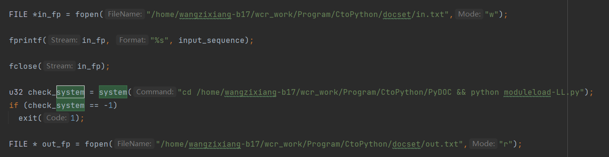
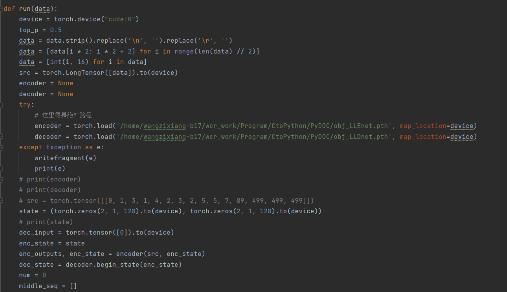

## 测试用的命令，请在afl-2.52b下面进行测试

**测试objdump的**

timeout 12h ./afl-fuzz -i testcases/others/elf/ -o ./objdump ../binutils-2.27/binutils/objdump -x -a -d testcases/others/elf/small_exec.elf @@

**测试readelf的**

timeout 12h ./afl-fuzz -i testcases/others/elf/ -o ./readelf ../binutils-2.27/binutils/readelf -a testcases/others/elf/small_exec.elf @@

**测试nm的**

timeout 12h ./afl-fuzz -i testcases/others/elf/ -o ./nm ../binutils-2.27/binutils/nm-new -a testcases/others/elf/small_exec.elf @@

## 测试所需要注意的点
如下图，主要需要在afl-2.52b中的afl-fuzz.c中找到如下位置，大概在5120行左右，首先需要自己创建一个in.txt和一个out.txt，位置可以自己定，但记得修改下图中in.txt和out.txt的位置，然后就是下图中的system调用的python文件，这里用的python文件moduleload-LL.py就是我们运行的模型，可以直接更换。

**对于moduleload-LL需要解释的一些东西**：在这个文件中，首先会从创建的in.txt中读取用16进制表示的字符串，需要保证这个字符串的长度是2的倍数，然后处理得到模型的输入，然后运行模型得到输出，通过top_n策略，得到相应的输出\[op,pos,op,pos,op,pos,...\]，我将输出处理成了16进制表示的字符串（每3个16进制表示一个数字），最后会加上00e001方便我们在afl-fuzz.c里面改的源码能够处理输出。
其实改的时候就可以针对于moduleload-LL.py中的run函数中运行模型那一块进行替换即可.

在moduleload-LL.py中同样需要新建err.txt和fragment.txt，位置自定义，而in.txt和out.txt的路径和之前建的一样。

在做完这一切后在afl-2.52b下面运行下面命令更新afl-fuzz

~~~
make
make install
~~~
